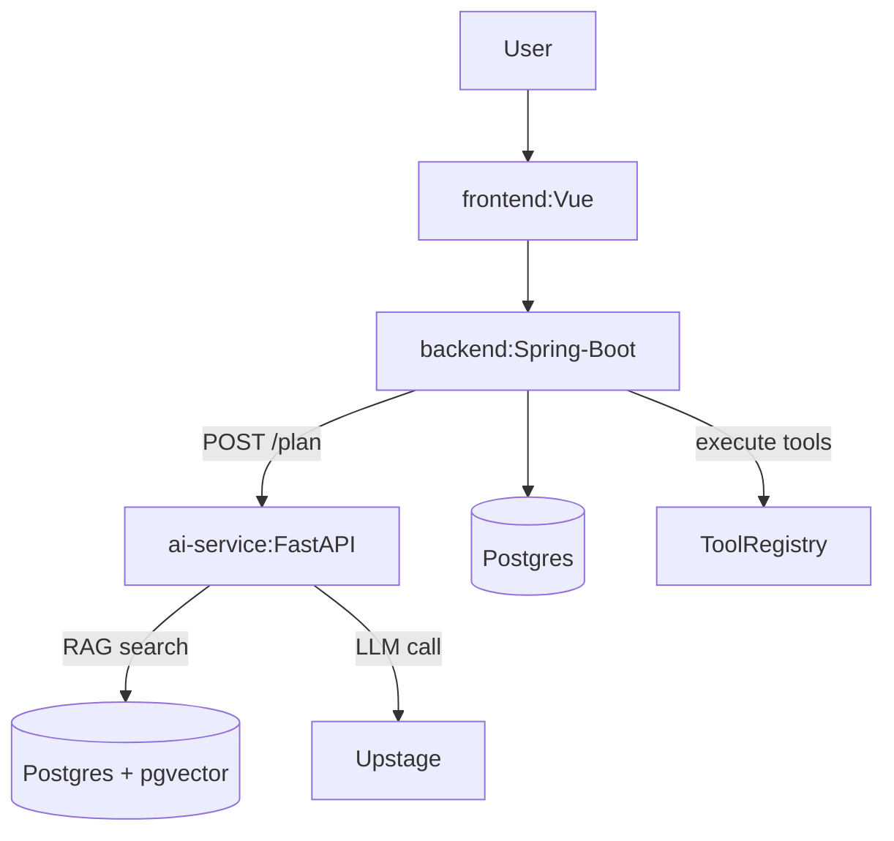

# approval-ops-agent (Prototype)

## 📌 Project Overview
- **승인 기반 업무 계획 에이전트**
- RAG+LLM으로 업무 요청을 실행 계획(JSON steps)으로 변환하고 승인 후 도구를 실행하는 프로토타입.

## ✅ AI 적용 지점
#### 1) LLM (Upstage)
- `ai-service`가 Upstage LLM을 호출해서 **업무 실행 계획(Plan)**을 JSON으로 생성.
- 결과는 `plan_json`으로 DB에 저장, 사람이 검토 후 승인/반려 가능.

#### 2) RAG (Vector DB 기반 근거 검색)
- Plan 생성 전에 `vector_store().similarity_search()`로 **문서 근거를 검색**.
- 검색된 문서 조각(context)을 프롬프트에 주입해서 **근거 기반 계획**을 생성.
- 응답에 `sources`를 함께 반환해서 “어떤 근거로 계획을 만들었는지” 추적 가능.

#### 3) LangChain
- LLM 호출과 VectorStore 검색을 LangChain 흐름으로 구성.
- “LLM 단독 호출”이 아니라 **검색+주입+생성(RAG pipeline)** 형태로 구성.

#### 4) Human-in-the-loop (승인/반려)
- AI가 만든 계획은 바로 실행하지 않고 **사람이 승인해야 실행**.

## 🛠️ Tech Stack
| Category | Technology |
| :--- | :--- |
| **Frontend** | Vue.js 3, Axios |
| **Backend** | Java 17, Spring Boot 3.5.9 |
| **AI / Logic** | Python 3.11, FastAPI, LangChain, Upstage |
| **벡터 DB** | Postgres + pgvector |
| **실행** | Docker Compose (DB + AI 서비스) |

## 📂 System Architecture


1) 사용자: 요청 생성 (`POST /api/requests`)
2) AI Planner: RAG 검색 → LLM으로 Plan(JSON) 생성 (`POST /api/requests/{id}/plan`)
3) 사람: 승인/반려 (`POST /api/requests/{id}/approve`)
4) Executor: 승인된 Plan의 steps를 ToolRegistry로 실행 (`POST /api/requests/{id}/execute`)
5) 결과: 생성된 티켓/위키/감사로그를 조회 (`GET /api/requests/{id}`)

## ⚙️ 실행 방법

1) Docker (DB + ai-service) 실행
```bash
$ docker compose up -d
```

* DB 생성이 자동으로 안될 경우
```bash
$ Get-Content .\backend\src\main\resources\db\migration\V1__init.sql | docker exec -i approval_ops_agent_db psql -U app -d approvalops
```

2) Backend 실행
```bash
cd backend
./gradlew bootRun
```

3) Frontend 실행
```
cd frontend
npm install
npm run dev
```


## 🎬 데모 영상
https://github.com/user-attachments/assets/25f0471d-3e8e-4b84-a77a-8a6b436a4cc9

### 테스트용 명령어
#### 명령어 ①
  - 제목
    > 배포 후 오류 대응 작업 - 티켓/문서/승인 플로우
  - 요청 내용 
    ```
    프로덕션 배포 이후 오류가 발생했어.
    티켓을 3개로 분해해서 각각 목적이 다르게 만들어줘: 1) 원인분석 2) 조치 3) 검증
    각 티켓의 제목과 설명(desc)을 서로 다르게 작성해줘.
    티켓 제목에는 시스템명 'ApprovalOpsAgent'를 반드시 포함해줘.
    외부 시스템 영향 가능성이 있는 변경이 포함되면 approval_required=true로 설정해줘.
    마지막으로 변경 배경/영향도/롤백 방법을 포함한 위키 문서 작성 단계도 계획에 넣어줘.
    근거 문서(context)를 기반으로 각 step에 why를 한 줄로 써줘.
    ```
#### 명령어 ②
  - 제목
    > 외부 시스템 설정 변경 요청 - 승인 필수 플랜 생성
  - 요청 내용
    ```
    외부 시스템 설정 변경이 필요한 운영 작업이야.
    승인 없이 진행하면 안 되니까 approval_required=true가 되게 계획해줘.
    작업은 티켓 3개로 나누고(준비/변경/검증), 제목에 ApprovalOpsAgent를 포함해줘.
    변경 전후 영향도와 롤백 절차를 위키에 남기는 단계도 포함해줘.
    근거(context)에 기반해 why를 각 step에 작성해줘.
    ```
#### 명령어 ③
  - 제목
    > 주간 운영 정리
  - 요청 내용
    ```
    주간 운영 업무를 정리하려고 해.
    티켓 3개로 나누고(점검/조치/검증), 제목에 ApprovalOpsAgent를 포함해줘.
    문서화 가이드에 맞게 변경 배경/영향도/롤백을 포함한 위키 작성 단계도 넣어줘.
    위험 작업이면 approval_required=true로 설정해줘.
    ```

